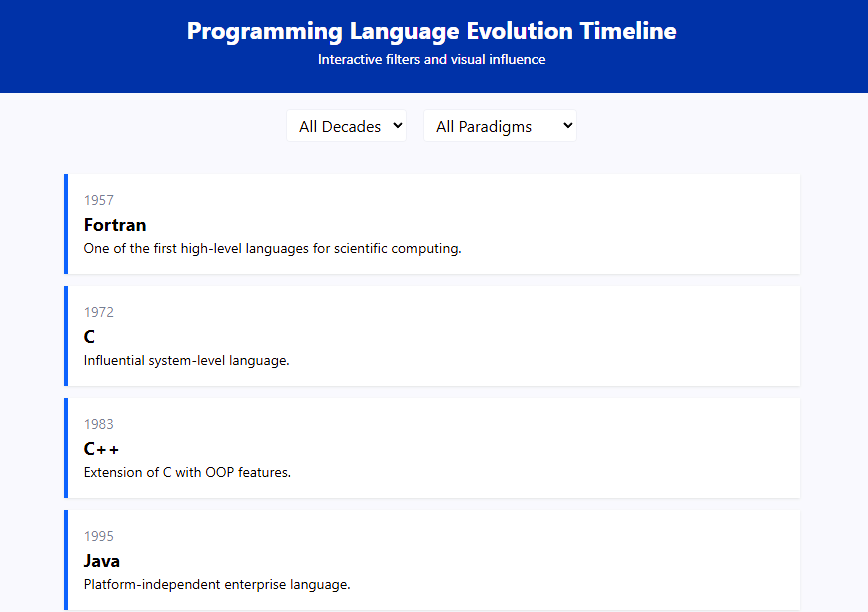

# Programming Language Evolution Timeline

An interactive web app that visualizes the timeline and influence of popular programming languages. Built with **React**, **Vite**, and **Tailwind CSS**.

---
## 📸 Screenshot



## ✨ Features

- 📅 Timeline with filtering by **decade** and **programming paradigm**
- 💡 Click a language to view full **details**, including:
  - Year of creation
  - Description
  - Designed by
  - Use cases
  - Official website
  - Code example
- 🎨 Clean UI with Tailwind styling
- ⚡ Super-fast development with Vite

---

## 🧰 Tech Stack

- **Frontend**: React + Vite
- **Styling**: Tailwind CSS
- **Data Visualization**: D3.js (or custom SVG rendering)
- **State Management**: React Hooks

## 🛠️ Installation & Running Locally

### 1. Clone the Repository

```bash
git clone https://github.com/Nomahk25/programming-language-timeline-react.git
cd programming-language-timeline-react
```

### 2. Install the Dependencies
```
npm install
```

### 3. Start the Development Server
```
npm run dev
```

Then open your browser and click on the link : http://localhost:5173

## 🖼️ Data Format (languages.json)

```
[
  {
    "name": "Python",
    "year": 1991,
    "paradigm": ["OOP", "Procedural"],
    "influencedBy": ["ABC", "Modula-3"],
    "influences": ["Ruby", "Go"]
  },
  ...
]
```

## ✍️ Author

Nomanguni Khumalo
📍 Johannesburg, South Africa
🎓 AI & Robotics Enthusiast

## 🤝 Contributing

Feel free to fork the project, add languages, improve visuals, or enhance interactivity.

Ideas:

- Add support for zoomable timelines
- Expand dataset to include 100+ languages
- Add search/filter by year or language name
- Toggle between vertical and horizontal timelines

## 💡 Inspiration

Inspired by the need to explore the rich and interconnected history of programming languages in a visual and interactive way, especially for learners and tech historians.

## 📄 License

This project is licensed under the MIT License.
